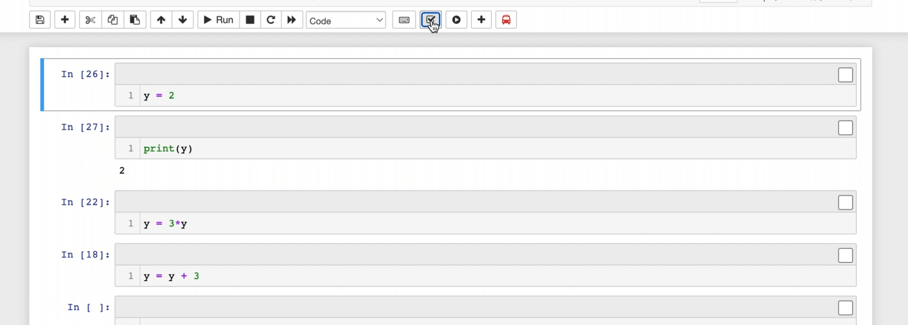
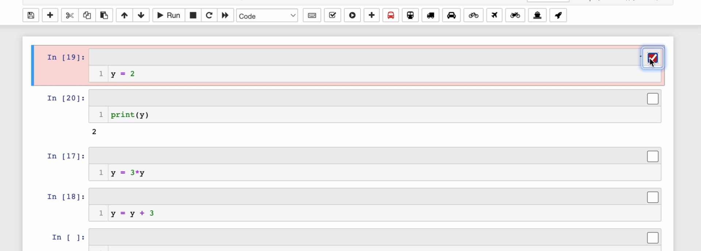
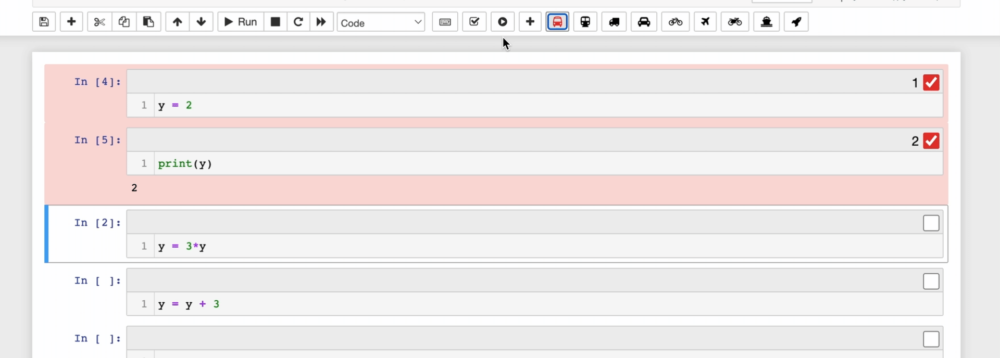

Group Group Go
==================

Group and run cells in customized sequence

A Jupyter Notebook extension by
lingzil@seas.upenn.edu &&
william9@seas.upenn.edu


# Usage
- Download the code, 
- Put it inside your ```~/jupyter_contrib_nbextensions/nbextensions``` folder as other notebook extensions
- Restart the notebook and you are good to go!

# Demo
### Enable the Extension


### Add and Switch between Groups


### Customize Running Sequences


### Navigate Groups

